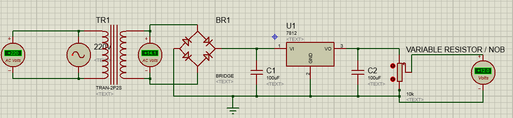
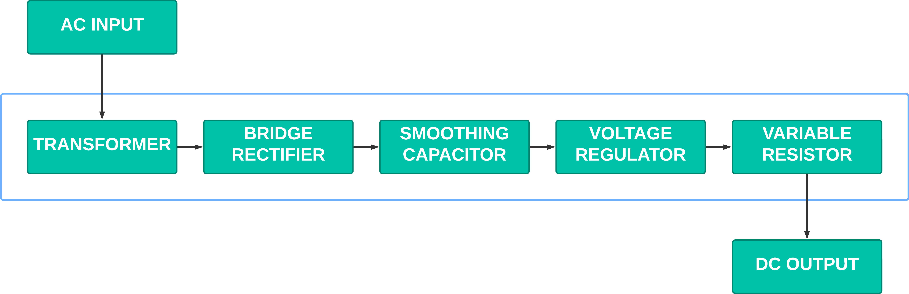

# 12v-Variable-Power-Supply 

This repository contains the design files for a 12V variable power supply project. The project includes a Proteus design file for the power supply circuit.

## Getting Started

- To get started with this project, you will need to have Proteus installed on your computer. You can open the `Power Supply Circuit.pdsprj` file in Proteus to view and simulate the power supply circuit.
- **PCB Circuit Is under development**

## Circuit Diagram

## Block Diagram

## License
 

**Note:** Only The Source Code Of This Website Is Covered Under The **[MIT License](https://opensource.org/license/mit)**.  
The Project Documentation Covered Under The **[Creative Commons Attribution-NonCommercial-ShareAlike 4.0 International License](https://creativecommons.org/licenses/by-nc-sa/4.0/)** But Some **Images, Blog Posts, And Other Content Are NOT  
Covered Under This License And Remain The Intellectual Property Of The Author**.

See the [LICENSE](LICENSE.md) file for details.
 
## Contact

For questions or contributions, please contact Muhammad Bin Khalid at [mbktechstudio.com/Support](https://mbktechstudio.com/Support/?Project=12v-Var-PSU), [support@mbktechstudio.com](mailto:support@mbktechstudio.com) or [chmuhammadbinkhalid28.com](mailto:chmuhammadbinkhalid28.com).